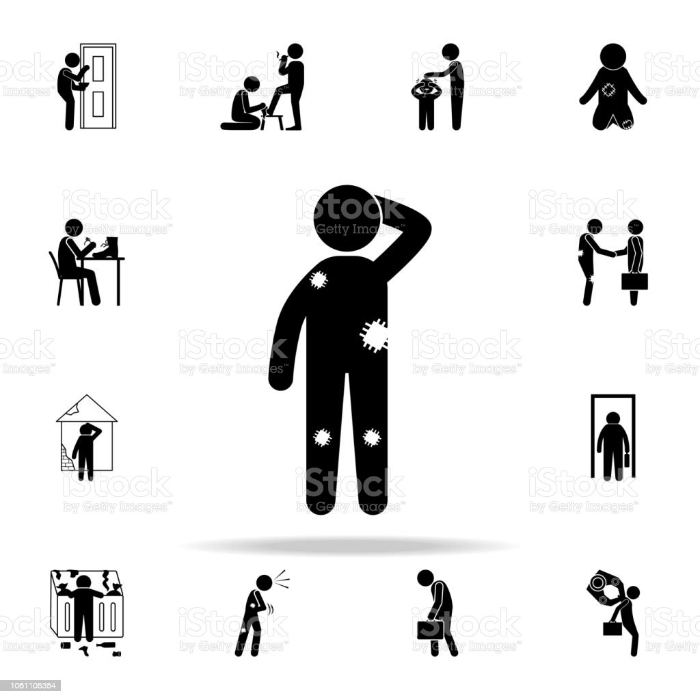

## Postdoc

* Blas bla bla bla jhkj kjhl khk khjkhl nkjhlk

## Phd

* Blas bla bla bla jhkj kjhl khk khjkhl nkjhlk

Mohammadreza
Phd

Tarbiat
bio: ddfg

sdfas kljl dsfd lljhil afeeafafsed sdffffff aaaaaaaaaaaaaaaaaaf kkkkkkkkkkkkkkk

 

A "newline". This text doesn't float anymore, is left-aligned.

## You're Breathtaking

\centering
At the 2019 rendition of E3, an eccentric gamer in attendance interrupted Keanu Reeves' presentation of the role-playing game (RPG) Cyberpunk 2077, loudly claiming, “"You're breathtaking,"” which was directed at the actor-cum-presenter. The image macro used to build the "You're Breathtaking" meme generally features a still of Keanu Reeves pointing at someone in the audience in front of him - that someone is Peter Sark, though there are no images from Keanu's point of view that have since been used as part of the "You're Breathtaking" meme.

