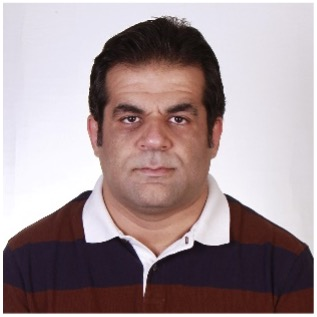

## Director

Mohammadreza Davoodi, Ph.D.

Assistant Professor, 
Department of Electrical & Computer Engineering, 
The University of Memphis, 
204C Engineering Science Bldg, 
3817 Central Ave, Memphis, TN 38111 
Tel: 901-678-3248 
Email: mdavoodi@memphis.edu 
 

## Students

Navid Dini, PhD student at UofM (2024-current) 
PhD: Electrical & Computer Engineering, Tarbiat Modares University 

Hamid Hafezi, PhD student at UofM (2023-current) 
MS: Electrical & Computer Engineering, K.N. Toosi University of Technology

Hussein Zolfaghari, PhD student at UofM (2023-current) 
MS: Electrical & Computer Engineering, Tarbiat Modares University 

## Former Postdoctoral Fellows

S. Iman Taheri, (Current employment: Assistant Professor of Teaching at Univ. of Memphis)

